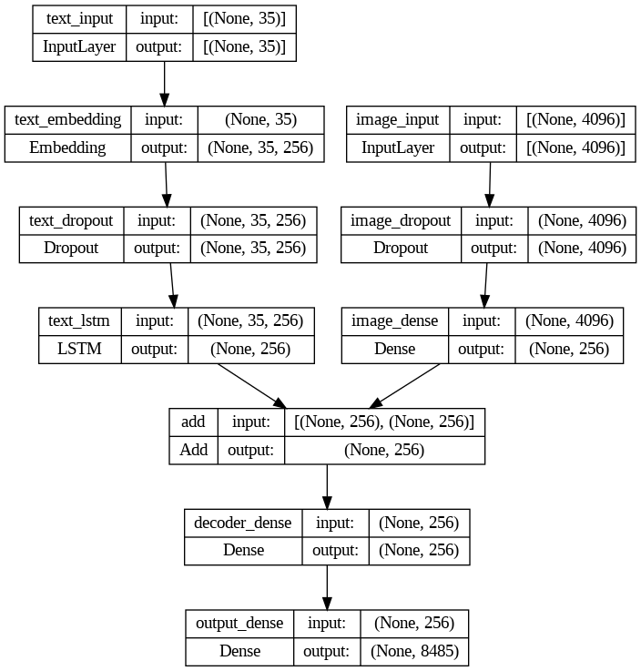

# Image Captioning Project
This project demonstrates an image captioning application using Streamlit, TensorFlow, and Python. The application allows users to upload an image, and it predicts a caption for the image using a deep learning model trained on a dataset of images and their corresponding captions.

## Introduction
This application showcases the application of AI in understanding and describing visual content. It was created as a project to demonstrate image captioning technology using a combination of Streamlit for the web interface and TensorFlow for the deep learning model.

## Working Website
```
https://image-captioning-website.streamlit.app/
```
## Features
- Upload an image and receive a predicted caption.
- Uses a pre-trained VGG16 model to extract image features.
- Deep learning model trained on a dataset of images and captions.
- 
## Demo
Visit this link for demo, Working of website and model.
```
https://youtu.be/Gqdgt2D9HO4
```
[](https://www.youtube.com/watch?v=Gqdgt2D9HO4)
## Installation
To get this project up and running locally on your machine, follow these steps:

- Clone the repository:

```bash
git clone https://github.com/yourusername/image-captioning.git
```
``` bash
cd image-captioning
```
- Create and activate a virtual environment:

```bash
python -m venv venv
source venv/bin/activate   # On Windows use `venv\Scripts\activate`
```
- Install the required dependencies:

```bash
pip install -r requirements.txt
```
- Download the pre-trained model weights and necessary files:
- Place the model_weights_epoch_1.h5 file in the model directory.
- Place the all_captions.pkl file in the project root directory.

## Usage
To start the Streamlit application, run the following command:
``` bash
streamlit run streamlit_app.py
```
## Model Details
The model architecture includes:

- Image Feature Extractor: VGG16 pre-trained on ImageNet.
- Text Processing: Tokenizer for converting text to sequences and embedding layers.
- Caption Generator: Combination of dense layers and LSTM for generating captions.

## Model


